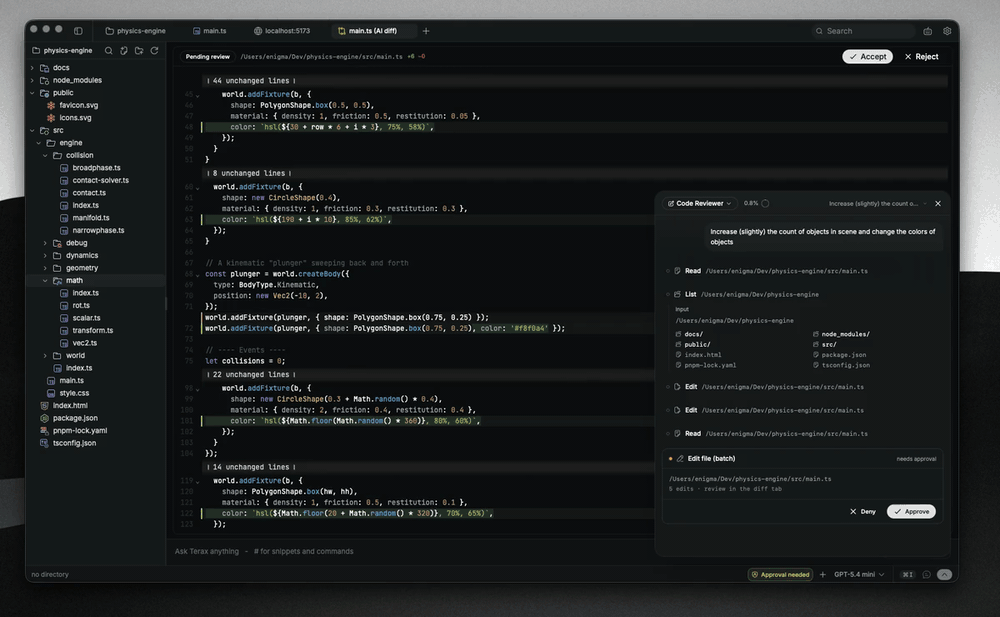

<div align="center">
  

  <h1>Terax</h1>

  <p><strong>The AI-native terminal. Open-source. BYOK. Lightweight.</strong></p>

  <p>
    <a href="https://github.com/crynta/terax-ai/releases/latest"></a>
    <a href="LICENSE"></a>
    <a href="https://github.com/crynta/terax-ai/stargazers"></a>
  </p>

  <p>
    <a href="#download"><strong>↓ Download</strong></a> ·
    <a href="#quick-start">Quick start</a> ·
    <a href="https://terax.app">Website</a> ·
    <a href="CONTRIBUTING.md">Contributing</a> ·
    <a href="https://github.com/crynta/terax-ai/issues">Issues</a>
  </p>
</div>

## Download

<p align="center">
  <a href="https://github.com/crynta/terax-ai/releases/latest/download/Terax_0.5.9_aarch64.dmg">
    
  </a>
  &nbsp;
  <a href="https://github.com/crynta/terax-ai/releases/latest/download/Terax_0.5.9_amd64.deb">
    
  </a>
  &nbsp;
  <a href="https://github.com/crynta/terax-ai/releases/latest/download/Terax-0.5.9-1.x86_64.rpm">
    
  </a>
</p>

<p align="center">
  <a href="https://github.com/crynta/terax-ai/releases/latest/download/Terax_0.5.9_amd64.AppImage">
    
  </a>
  &nbsp;
  <a href="https://github.com/crynta/terax-ai/releases/latest">
    
  </a>
</p>

<p align="center">
  <sub>
    All builds, checksums, and signatures on the <a href="https://github.com/crynta/terax-ai/releases/latest">releases page</a>.
    <br />
    <strong>macOS Intel</strong>: no native Intel build is published yet — run via Rosetta with the Apple Silicon DMG, or <a href="#quick-start">build from source</a>.
  </sub>
</p>

<p align="center">
  
</p>

> Terax is a fast, lightweight AI terminal (ADE) built on Tauri 2 + Rust and React 19. It pairs a native PTY backend with a modern UI — multi-tab terminals, an integrated code editor, a file explorer, and a first-class AI side-panel that works with your own API keys (or fully local models via LM Studio). Under 10 MB on disk, no telemetry, keys stored in the OS keychain.

## Quick start

One copy-paste from a fresh clone:

```bash
git clone https://github.com/crynta/terax-ai.git
cd terax-ai
pnpm install
pnpm tauri dev          # development build, hot-reload
pnpm tauri build        # production bundle (writes to src-tauri/target/release)
```

**Prerequisites**: [Rust stable](https://rustup.rs) · Node 20+ · [pnpm](https://pnpm.io) · platform [Tauri prerequisites](https://tauri.app/start/prerequisites/).

## Configure AI

1. Open **Settings → AI**.
2. Pick a provider and paste your API key. For local inference, point Terax at your LM Studio endpoint.
3. Keys are written to the OS keychain via `keyring` — they never touch disk or `localStorage`.

## Features

**Terminal**

- xterm.js + WebGL renderer, multi-tab with background streaming
- Native PTY backend via `portable-pty` (zsh, bash, pwsh, …)
- Shell integration (cwd reporting, prompt markers) via injected init scripts
- Inline search, link detection, true-color

**Editor**

- CodeMirror 6 with language support for TS/JS, Rust, Python, HTML/CSS, JSON, Markdown
- Inline AI autocomplete and AI edit diffs
- Vim mode
- Prebuilt themes: Tokyo Night, Nord, GitHub, Atom One, Aura, Copilot, Xcode

**File Explorer**

- Catppuccin icon theme (Material Icon Theme resolver)
- Fuzzy search, keyboard navigation, inline rename, context actions

**Web Preview**

- Auto-detects local dev servers and opens them in a preview tab

**AI (BYOK)**

- Providers: OpenAI, Anthropic, Google, Groq, xAI, Cerebras, OpenAI-compatible
- Local / offline models via LM Studio
- Voice input, edit diffs, multi-agent and sub-agents
- Snippets / skills, customizable system prompt
- `TERAX.md` for project memory and configuration
- Tasks, plans, search, file read/write tools with approval flow

**Quality**

- Lightweight and fast (~7 MB bundle)
- API keys stored in the OS keychain
- No telemetry, no account required

## Windows notes

- **SmartScreen warning**: Windows will show "Windows protected your PC" on first launch because we (temporarily) don't have a code-signing certificate yet. Click **More info** → **Run anyway**. This is normal for unsigned open-source apps.

The default shell is detected in this order: `pwsh.exe` (PowerShell 7+) → `powershell.exe` (Windows PowerShell 5.1) → `cmd.exe`.

## Tech stack

Tauri 2 · Rust · `portable-pty` · React 19 · TypeScript · xterm.js · CodeMirror 6 · Vercel AI SDK v6 · Tailwind v4 · shadcn/ui · Zustand

## Contributing

Issues and PRs are welcome — see [CONTRIBUTING.md](CONTRIBUTING.md). For security disclosures, see [SECURITY.md](SECURITY.md).

## License

Terax is licensed under the [Apache-2.0 License](LICENSE).
